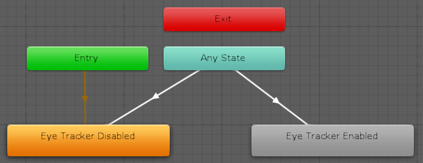
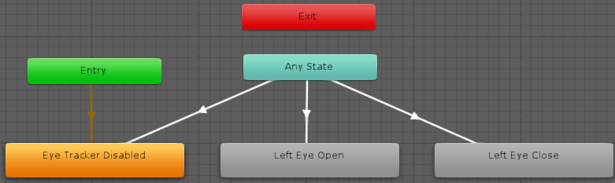
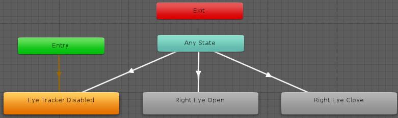
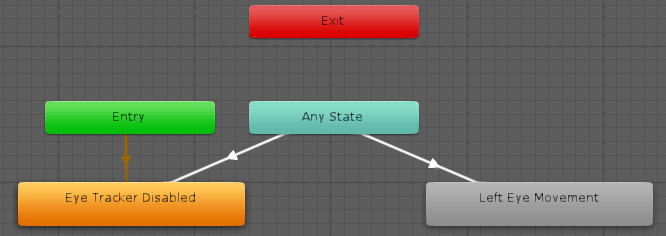
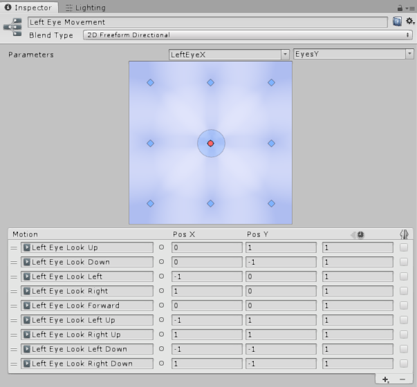
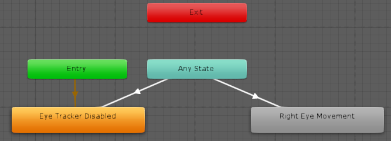
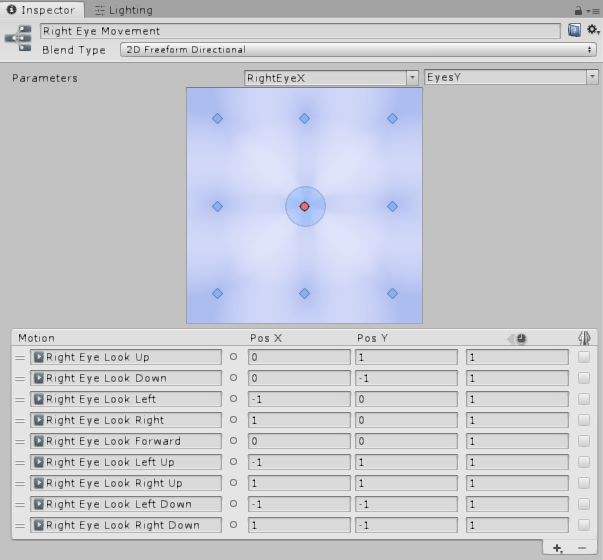

# VRCPimaxEyeTracker

VRCPimaxEyeTracker is a VRChat plugin supporting VRCSDK3 avatar eye tracking using the 7invensun Droolon Pi1 eye tracker designed for Pimax headsets.

> :warning: **This documentation is a work in progress and may change over time.**

- [Installation](#installation)
- [Supported Parameters](#supported-parameters)
- [Avatar Creation](#avatar-creation)
   - [Blend Shapes](#blend-shapes)
   - [Expression Parameters](#expression-parameters)
   - [Expression Menu](#expression-menu)
   - [Simulated Eye Tracking](#simulated-eye-tracking)
   - [Avatar Constraints](#avatar-constraints)
   - [Avatar Masks](#avatar-masks)
   - [Animator Parameters](#animator-parameters)
   - [Layers](#layers)
   - [Animations](#animations)

# Installation

> :warning: **USE THIS PLUGIN AT YOUR OWN RISK!**
> 
> **Modifying the VRChat client is a breach of VRChat's Terms of Service and can result in temporary or permanent account suspension. Any authors or contributers of this plugin will not be held responsible for suspended accounts, privacy breaches, etc.**

> :warning: **Ensure that the aSeeVR Runtime software is installed (typically installed via PiTool) and running, and that your Droolon Pi1 eye tracker is correctly installed and calibrated using the aSeeVR calibration utility before using this plugin.**

1. Download and install [MelonLoader](https://melonwiki.xyz/) (requires 0.3.0 or higher).
1. Download [VRCPimaxEyeTracker](https://github.com/NGenesis/VRCPimaxEyeTracker/releases) and extract the contents of the archive to any location.
1. Copy `PimaxEyeTrackerNative.dll` and `aSeeVRClient.dll` to your VRChat installation folder, in the same location where `VRChat.exe` is located.
1. Copy `VRCPimaxEyeTracker.dll`to your Mods folder.

# Supported Parameters

| Name | Eye | Type | Value&nbsp;/&nbsp;Range | Description |
| --- | :---: | :---: | :---: | --- |
| UseEyeTracker | - | Bool | False, True | When set to true by the user via the quick menu or an animator, hardware eye tracking will be enabled. |
| LeftEyeBlink | Left | Bool | False, True | Returns true when the user's left eye is closed. |
| RightEyeBlink | Right | Bool | False, True | Returns true when the user's right eye is closed. |
| LeftEyeLid | Left | Float | 0.0 ~ 1.0 | Returns 0.0 when the user's left eye is fully closed and 1.0 when fully open. |
| RightEyeLid | Right | Float | 0.0 ~ 1.0 | Returns 0.0 when the user's right eye is fully closed and 1.0 when fully open. |
| LeftEyeX | Left | Float | -1.0 ~ 1.0 | Returns -1.0 when the user's left eye is looking to the left, 0.0 when looking forward and 1.0 when looking to the right. |
| RightEyeX | Right | Float | -1.0 ~ 1.0 | Returns -1.0 when the user's right eye is looking to the left, 0.0 when looking forward and 1.0 when looking to the right. |
| LeftEyeY | Left | Float | -1.0 ~ 1.0 | Returns -1.0 when the user's left eye is looking down, 0.0 when looking forward and 1.0 when looking up. |
| RightEyeY | Right | Float | -1.0 ~ 1.0 | Returns -1.0 when the user's right eye is looking down, 0.0 when looking forward and 1.0 when looking up. |
| EyesX | Left&nbsp;/&nbsp;Right | Float | -1.0 ~ 1.0 | Returns -1.0 when the user's left or right eye is looking to the left, 0.0 when looking forward and 1.0 when looking to the right. |
| EyesY | Left&nbsp;/&nbsp;Right | Float | -1.0 ~ 1.0 | Returns -1.0 when the user's left or right eye is looking down, 0.0 when looking forward and 1.0 when looking up. |

# Avatar Creation

## Blend Shapes
| Name | Preview |
| --- | --- |
| Eyes Blink |  |
| Right Eye Blink |  |
| Left Eye Blink |  |
| Eyes Look Forward |  |
| Right Eye Look Right Up |  |
| Right Eye Look Up |  |
| Right Eye Look Left Up |  |
| Right Eye Look Right |  |
| Right Eye Look Left |  |
| Right Eye Look Right Down |  |
| Right Eye Look Down |  |
| Right Eye Look Left Down |  |
| Left Eye Look Right Up |  |
| Left Eye Look Up |  |
| Left Eye Look Left Up |  |
| Left Eye Look Right |  |
| Left Eye Look Left |  |
| Left Eye Look Right Down |  |
| Left Eye Look Down |  |
| Left Eye Look Left Down |  |

## Expression Parameters

The following parameters will be used in this guide, which will support toggling between hardware and simulated eye tracking, independent eye blinking, independent horizontal left/right eye movement and combined vertical left/right movement for optimization.

Please refer to [Support Parameters](#supported-parameters) for a complete list of available parameters.

| Name | Type | Default | Saved |
| --- | --- | --- | --- |
| UseEyeTracker | Bool | True | True |
| LeftEyeBlink | Bool | False | False |
| RightEyeBlink | Bool | False | False |
| LeftEyeX | Float | 0 | False |
| RightEyeX | Float | 0 | False |
| EyesY | Float | 0 | False |

## Expression Menu

Add a VRC Expression Menu with a toggle button to start / stop the eye tracker and switch between hardware or default simulated eye tracking.

| Name | Type | Parameter |
| --- | --- | --- |
| Eye Tracker | Toggle | UseEyeTracker |

## Simulated Eye Tracking

Simulated eye tracking should be set up as normal in the VRC Avatar Descriptor.  The `Blink` blend shape should be set to `Eyes Blink` and eye bones should be assigned (indicated as `Eye_L` and `Eye_R` in this guide).

## Avatar Constraints

These constraints will be used to reset the eye bone transforms while hardware eye tracking is active.

- Create a dummy object for each eye bone (e.g. `Eye_L_EyeTrackerDisabled` and `Eye_R_EyeTrackerDisabled`) that has the same transform as the original respective eye bone (e.g. `Eye_L` and `Eye_R`) under the `Head` bone.
- On the left eye bone (e.g. `Eye_L`):
  - Add a `Rotation Constraint` component to each original bone
    - Uncheck `Is Active`
    - Set `Weight` to `1`
    - Add the dummy object (e.g. `Eye_L_EyeTrackerDisabled`) to `Source` with a weight of `1`
- On the right eye bone (e.g. `Eye_R`):
  - Add a `Rotation Constraint` component to each original bone
    - Uncheck `Is Active`
    - Set `Weight` to `1`
    - Add the dummy object (e.g. `Eye_R_EyeTrackerDisabled`) to `Source` with a weight of `1`

## Avatar Masks

Create avatar masks called `Left Eye` and `Right Eye` using each eye's respective eye bones (e.g. `Eye_L` and `Eye_R`) that will be assigned to the layers below.

## Animator Parameters

| Name | Type | Default |
| --- | --- | --- |
| UseEyeTracker | Bool | False |
| LeftEyeBlink | Bool | False |
| RightEyeBlink | Bool | False |
| LeftEyeX | Float | 0.0 |
| RightEyeX | Float | 0.0 |
| EyesY | Float | 0.0 |

## Layers

All layers should be added to the `FX` animation controller.

### Use Eye Tracker

#### Layer Settings
| Property | Value |
| --- | --- |
| Weight | 1 |
| Mask | None |
| Blending | Override |

#### States

- **Eye Tracker Disabled**
  - Set `Motion` to [`Disable Eye Tracker`](#disable-eye-tracker)
  - Add Behaviours:
    - VRCAnimatorTrackingControl - Set `Eyes & Eyelids` to `Tracking`
    - VRCAnimatorLayerControl - Set `Playable` to `FX`, set `Layer` to `2`, and set `Goal Weight` to `0`
    - VRCAnimatorLayerControl - Set `Playable` to `FX`, set `Layer` to `3`, and set `Goal Weight` to `0`
    - VRCAnimatorLayerControl - Set `Playable` to `FX`, set `Layer` to `4`, and set `Goal Weight` to `0`
    - VRCAnimatorLayerControl - Set `Playable` to `FX`, set `Layer` to `5`, and set `Goal Weight` to `0`

- **Eye Tracker Enabled**
  - Set `Motion` to [`Enable Eye Tracker`](#enable-eye-tracker)
  - Add Behaviours:
    - VRCAnimatorTrackingControl - Set `Eyes & Eyelids` to `Animation`
    - VRCAnimatorLayerControl - Set `Playable` to `FX`, and set `Layer` to `2`, and set `Goal Weight` to `1`
    - VRCAnimatorLayerControl - Set `Playable` to `FX`, and set `Layer` to `3`, and set `Goal Weight` to `1`
    - VRCAnimatorLayerControl - Set `Playable` to `FX`, and set `Layer` to `4`, and set `Goal Weight` to `1`
    - VRCAnimatorLayerControl - Set `Playable` to `FX`, and set `Layer` to `5`, and set `Goal Weight` to `1`

> :warning: **Note that layer numbers may need to be adjusted accordingly so that they correspond with the the following layers:**
> - **[Left Eye Blink](#left-eye-blink) (2)**
> - **[Right Eye Blink](#right-eye-blink) (3)**
> - **[Left Eye Movement](#left-eye-movement) (4)**
> - **[Right Eye Movement](#right-eyemovement) (5)**

#### Transitions

| Source State | Destination State | Conditions |
| --- | --- | --- |
| Any State | Eye Tracker Disabled | UseEyeTracker: false |
| Any State | Eye Tracker Enabled | UseEyeTracker: true |

### Left Eye Blink

#### Layer Settings

| Property | Value |
| --- | --- |
| Weight | 1 |
| Mask | Left Eye |
| Blending | Override |

#### States

- **Eye Tracker Disabled**
  - Set `Motion` to `None`
- **Left Eye Open**
  - Set `Motion` to [`Left Eye Open`](#left-eye-open)
- **Left Eye Close**
  - Set `Motion` to [`Left Eye Close`](#left-eye-close)

#### Transitions

| Source State | Destination State | Conditions |
| --- | --- | --- |
| Any State | Eye Tracker Disabled | UseEyeTracker: false |
| Any State | Left Eye Open | LeftEyeBlink: false, UseEyeTracker: true |
| Any State | Left Eye Closed | LeftEyeBlink: true, UseEyeTracker: true |

### Right Eye Blink

#### Layer Settings

| Property | Value |
| --- | --- |
| Weight | 1 |
| Mask | Right Eye |
| Blending | Override |

#### States

- **Eye Tracker Disabled**
  - Set `Motion` to `None`
- **Right Eye Open**
  - Set `Motion` to [`Right Eye Open`](#right-eye-open)
- **Right Eye Close**
  - Set `Motion` to [`Right Eye Close`](#right-eye-close)

#### Transitions

| Source State | Destination State | Conditions |
| --- | --- | --- |
| Any State | Eye Tracker Disabled | UseEyeTracker: false |
| Any State | Right Eye Open | RightEyeBlink: false, UseEyeTracker: true |
| Any State | Right Eye Closed | RightEyeBlink: true, UseEyeTracker: true |

### Left Eye Movement

#### Layer Settings

| Property | Value |
| --- | --- |
| Weight | 1 |
| Mask | Left Eye |
| Blending | Override |

- **Eye Tracker Disabled**
  - Set `Motion` to `None`

- **Left Eye Movement**
  - Create as Blend Tree
  - Set `Blend Type` to `2D Freeform Directional`
  - Set `Parameters` to `LeftEyeX` and `EyesY`
  - Add Motions:

| Motion | Pos X | Pos Y |
| --- | --- | --- |
| [Left Eye Look Up](#left-eye-look-up) | 0 | 1 |
| [Left Eye Look Down](#left-eye-look-down) | 0 | -1 |
| [Left Eye Look Left](#left-eye-look-left) | -1 | 0 |
| [Left Eye Look Right](#left-eye-look-right) | 1 | 0 |
| [Left Eye Look Forward](#left-eye-look-forward) | 0 | 0 |
| [Left Eye Look Left Up](#left-eye-look-left-up) | -1 | 1 |
| [Left Eye Look Right Up](#left-eye-look-right-up) | 1 | 1 |
| [Left Eye Look Left Down](#left-eye-look-left-down) | -1 | -1 |
| [Left Eye Look Right Down](#left-eye-look-right-down) | 1 | -1 |

#### Transitions

| Source State | Destination State | Conditions |
| --- | --- | --- |
| Any State | Eye Tracker Disabled | UseEyeTracker: false |
| Any State | Left Eye Movement | UseEyeTracker: true |

### Right Eye Movement

#### Layer Settings

| Property | Value |
| --- | --- |
| Weight | 1 |
| Mask | Right Eye |
| Blending | Override |

- **Eye Tracker Disabled**
  - Set `Motion` to `None`

- **Right Eye Movement**
  - Create as Blend Tree
  - Set `Blend Type` to `2D Freeform Directional`
  - Set `Parameters` to `RightEyeX` and `EyesY`
  - Add Motions:

| Motion | Pos X | Pos Y |
| --- | --- | --- |
| [Right Eye Look Up](#right-eye-look-up) | 0 | 1 |
| [Right Eye Look Down](#right-eye-look-down) | 0 | -1 |
| [Right Eye Look Left](#right-eye-look-left) | -1 | 0 |
| [Right Eye Look Right](#right-eye-look-right) | 1 | 0 |
| [Right Eye Look Forward](#right-eye-look-forward) | 0 | 0 |
| [Right Eye Look Left Up](#right-eye-look-left-up) | -1 | 1 |
| [Right Eye Look Right Up](#right-eye-look-right-up) | 1 | 1 |
| [Right Eye Look Left Down](#right-eye-look-left-down) | -1 | -1 |
| [Right Eye Look Right Down](#right-eye-look-right-down) | 1 | -1 |

#### Transitions

| Source State | Destination State | Conditions |
| --- | --- | --- |
| Any State | Eye Tracker Disabled | UseEyeTracker: false |
| Any State | Right Eye Movement | UseEyeTracker: true |

## Animations

### Disable Eye Tracker

| Property | Value |
| --- | --- |
| Eye_L : Rotation Constraint.Active | false |
| Eye_R : Rotation Constraint.Active | false |

### Enable Eye Tracker

| Property | Value |
| --- | --- |
| Body: Skinned Mesh Renderer.Blend Shape.Eyes Blink | 0 |
| Eye_L : Rotation Constraint.Active | true |
| Eye_R : Rotation Constraint.Active | true |

### Left Eye Open

| Property | Value |
| --- | --- |
| Body : Skinned Mesh Renderer.Blend Shape.Left Eye Blink | 0 |

### Left Eye Close

| Property | Value |
| --- | --- |
| Body : Skinned Mesh Renderer.Blend Shape.Left Eye Blink | 100 |

### Left Eye Look Forward

| Property | Value |
| --- | --- |
| Body : Skinned Mesh Renderer.Blend Shape.Eyes Look Forward | 100 |
| Body : Skinned Mesh Renderer.Blend Shape.Left Eye Look Down | 0 |
| Body : Skinned Mesh Renderer.Blend Shape.Left Eye Look Left | 0 |
| Body : Skinned Mesh Renderer.Blend Shape.Left Eye Look Left Down | 0 |
| Body : Skinned Mesh Renderer.Blend Shape.Left Eye Look Left Up | 0 |
| Body : Skinned Mesh Renderer.Blend Shape.Left Eye Look Right | 0 |
| Body : Skinned Mesh Renderer.Blend Shape.Left Eye Look Right Down | 0 |
| Body : Skinned Mesh Renderer.Blend Shape.Left Eye Look Right Up | 0 |
| Body : Skinned Mesh Renderer.Blend Shape.Left Eye Look Up | 0 |

### Left Eye Look Down

| Property | Value |
| --- | --- |
| Body : Skinned Mesh Renderer.Blend Shape.Eyes Look Forward | 0 |
| Body : Skinned Mesh Renderer.Blend Shape.Left Eye Look Down | 100 |
| Body : Skinned Mesh Renderer.Blend Shape.Left Eye Look Left | 0 |
| Body : Skinned Mesh Renderer.Blend Shape.Left Eye Look Left Down | 0 |
| Body : Skinned Mesh Renderer.Blend Shape.Left Eye Look Left Up | 0 |
| Body : Skinned Mesh Renderer.Blend Shape.Left Eye Look Right | 0 |
| Body : Skinned Mesh Renderer.Blend Shape.Left Eye Look Right Down | 0 |
| Body : Skinned Mesh Renderer.Blend Shape.Left Eye Look Right Up | 0 |
| Body : Skinned Mesh Renderer.Blend Shape.Left Eye Look Up | 0 |

### Left Eye Look Left

| Property | Value |
| --- | --- |
| Body : Skinned Mesh Renderer.Blend Shape.Eyes Look Forward | 0 |
| Body : Skinned Mesh Renderer.Blend Shape.Left Eye Look Down | 0 |
| Body : Skinned Mesh Renderer.Blend Shape.Left Eye Look Left | 100 |
| Body : Skinned Mesh Renderer.Blend Shape.Left Eye Look Left Down | 0 |
| Body : Skinned Mesh Renderer.Blend Shape.Left Eye Look Left Up | 0 |
| Body : Skinned Mesh Renderer.Blend Shape.Left Eye Look Right | 0 |
| Body : Skinned Mesh Renderer.Blend Shape.Left Eye Look Right Down | 0 |
| Body : Skinned Mesh Renderer.Blend Shape.Left Eye Look Right Up | 0 |
| Body : Skinned Mesh Renderer.Blend Shape.Left Eye Look Up | 0 |

### Left Eye Look Left Down

| Property | Value |
| --- | --- |
| Body : Skinned Mesh Renderer.Blend Shape.Eyes Look Forward | 0 |
| Body : Skinned Mesh Renderer.Blend Shape.Left Eye Look Down | 0 |
| Body : Skinned Mesh Renderer.Blend Shape.Left Eye Look Left | 0 |
| Body : Skinned Mesh Renderer.Blend Shape.Left Eye Look Left Down | 100 |
| Body : Skinned Mesh Renderer.Blend Shape.Left Eye Look Left Up | 0 |
| Body : Skinned Mesh Renderer.Blend Shape.Left Eye Look Right | 0 |
| Body : Skinned Mesh Renderer.Blend Shape.Left Eye Look Right Down | 0 |
| Body : Skinned Mesh Renderer.Blend Shape.Left Eye Look Right Up | 0 |
| Body : Skinned Mesh Renderer.Blend Shape.Left Eye Look Up | 0 |

### Left Eye Look Left Up

| Property | Value |
| --- | --- |
| Body : Skinned Mesh Renderer.Blend Shape.Eyes Look Forward | 0 |
| Body : Skinned Mesh Renderer.Blend Shape.Left Eye Look Down | 0 |
| Body : Skinned Mesh Renderer.Blend Shape.Left Eye Look Left | 0 |
| Body : Skinned Mesh Renderer.Blend Shape.Left Eye Look Left Down | 0 |
| Body : Skinned Mesh Renderer.Blend Shape.Left Eye Look Left Up | 100 |
| Body : Skinned Mesh Renderer.Blend Shape.Left Eye Look Right | 0 |
| Body : Skinned Mesh Renderer.Blend Shape.Left Eye Look Right Down | 0 |
| Body : Skinned Mesh Renderer.Blend Shape.Left Eye Look Right Up | 0 |
| Body : Skinned Mesh Renderer.Blend Shape.Left Eye Look Up | 0 |

### Left Eye Look Right

| Property | Value |
| --- | --- |
| Body : Skinned Mesh Renderer.Blend Shape.Eyes Look Forward | 0 |
| Body : Skinned Mesh Renderer.Blend Shape.Left Eye Look Down | 0 |
| Body : Skinned Mesh Renderer.Blend Shape.Left Eye Look Left | 0 |
| Body : Skinned Mesh Renderer.Blend Shape.Left Eye Look Left Down | 0 |
| Body : Skinned Mesh Renderer.Blend Shape.Left Eye Look Left Up | 0 |
| Body : Skinned Mesh Renderer.Blend Shape.Left Eye Look Right | 100 |
| Body : Skinned Mesh Renderer.Blend Shape.Left Eye Look Right Down | 0 |
| Body : Skinned Mesh Renderer.Blend Shape.Left Eye Look Right Up | 0 |
| Body : Skinned Mesh Renderer.Blend Shape.Left Eye Look Up | 0 |

### Left Eye Look Right Down

| Property | Value |
| --- | --- |
| Body : Skinned Mesh Renderer.Blend Shape.Eyes Look Forward | 0 |
| Body : Skinned Mesh Renderer.Blend Shape.Left Eye Look Down | 0 |
| Body : Skinned Mesh Renderer.Blend Shape.Left Eye Look Left | 0 |
| Body : Skinned Mesh Renderer.Blend Shape.Left Eye Look Left Down | 0 |
| Body : Skinned Mesh Renderer.Blend Shape.Left Eye Look Left Up | 0 |
| Body : Skinned Mesh Renderer.Blend Shape.Left Eye Look Right | 0 |
| Body : Skinned Mesh Renderer.Blend Shape.Left Eye Look Right Down | 100 |
| Body : Skinned Mesh Renderer.Blend Shape.Left Eye Look Right Up | 0 |
| Body : Skinned Mesh Renderer.Blend Shape.Left Eye Look Up | 0 |

### Left Eye Look Right Up

| Property | Value |
| --- | --- |
| Body : Skinned Mesh Renderer.Blend Shape.Eyes Look Forward | 0 |
| Body : Skinned Mesh Renderer.Blend Shape.Left Eye Look Down | 0 |
| Body : Skinned Mesh Renderer.Blend Shape.Left Eye Look Left | 0 |
| Body : Skinned Mesh Renderer.Blend Shape.Left Eye Look Left Down | 0 |
| Body : Skinned Mesh Renderer.Blend Shape.Left Eye Look Left Up | 0 |
| Body : Skinned Mesh Renderer.Blend Shape.Left Eye Look Right | 0 |
| Body : Skinned Mesh Renderer.Blend Shape.Left Eye Look Right Down | 0 |
| Body : Skinned Mesh Renderer.Blend Shape.Left Eye Look Right Up | 100 |
| Body : Skinned Mesh Renderer.Blend Shape.Left Eye Look Up | 0 |

### Left Eye Look Up

| Property | Value |
| --- | --- |
| Body : Skinned Mesh Renderer.Blend Shape.Eyes Look Forward | 0 |
| Body : Skinned Mesh Renderer.Blend Shape.Left Eye Look Down | 0 |
| Body : Skinned Mesh Renderer.Blend Shape.Left Eye Look Left | 0 |
| Body : Skinned Mesh Renderer.Blend Shape.Left Eye Look Left Down | 0 |
| Body : Skinned Mesh Renderer.Blend Shape.Left Eye Look Left Up | 0 |
| Body : Skinned Mesh Renderer.Blend Shape.Left Eye Look Right | 0 |
| Body : Skinned Mesh Renderer.Blend Shape.Left Eye Look Right Down | 0 |
| Body : Skinned Mesh Renderer.Blend Shape.Left Eye Look Right Up | 0 |
| Body : Skinned Mesh Renderer.Blend Shape.Left Eye Look Up | 100 |

### Right Eye Open

| Property | Value |
| --- | --- |
| Body : Skinned Mesh Renderer.Blend Shape.Right Eye Blink | 0 |

### Right Eye Close

| Property | Value |
| --- | --- |
| Body : Skinned Mesh Renderer.Blend Shape.Right Eye Blink | 100 |

### Right Eye Look Forward

| Property | Value |
| --- | --- |
| Body : Skinned Mesh Renderer.Blend Shape.Eyes Look Forward | 100 |
| Body : Skinned Mesh Renderer.Blend Shape.Right Eye Look Down | 0 |
| Body : Skinned Mesh Renderer.Blend Shape.Right Eye Look Left | 0 |
| Body : Skinned Mesh Renderer.Blend Shape.Right Eye Look Left Down | 0 |
| Body : Skinned Mesh Renderer.Blend Shape.Right Eye Look Left Up | 0 |
| Body : Skinned Mesh Renderer.Blend Shape.Right Eye Look Right | 0 |
| Body : Skinned Mesh Renderer.Blend Shape.Right Eye Look Right Down | 0 |
| Body : Skinned Mesh Renderer.Blend Shape.Right Eye Look Right Up | 0 |
| Body : Skinned Mesh Renderer.Blend Shape.Right Eye Look Up | 0 |

### Right Eye Look Down

| Property | Value |
| --- | --- |
| Body : Skinned Mesh Renderer.Blend Shape.Eyes Look Forward | 0 |
| Body : Skinned Mesh Renderer.Blend Shape.Right Eye Look Down | 100 |
| Body : Skinned Mesh Renderer.Blend Shape.Right Eye Look Left | 0 |
| Body : Skinned Mesh Renderer.Blend Shape.Right Eye Look Left Down | 0 |
| Body : Skinned Mesh Renderer.Blend Shape.Right Eye Look Left Up | 0 |
| Body : Skinned Mesh Renderer.Blend Shape.Right Eye Look Right | 0 |
| Body : Skinned Mesh Renderer.Blend Shape.Right Eye Look Right Down | 0 |
| Body : Skinned Mesh Renderer.Blend Shape.Right Eye Look Right Up | 0 |
| Body : Skinned Mesh Renderer.Blend Shape.Right Eye Look Up | 0 |

### Right Eye Look Left

| Property | Value |
| --- | --- |
| Body : Skinned Mesh Renderer.Blend Shape.Eyes Look Forward | 0 |
| Body : Skinned Mesh Renderer.Blend Shape.Right Eye Look Down | 0 |
| Body : Skinned Mesh Renderer.Blend Shape.Right Eye Look Left | 100 |
| Body : Skinned Mesh Renderer.Blend Shape.Right Eye Look Left Down | 0 |
| Body : Skinned Mesh Renderer.Blend Shape.Right Eye Look Left Up | 0 |
| Body : Skinned Mesh Renderer.Blend Shape.Right Eye Look Right | 0 |
| Body : Skinned Mesh Renderer.Blend Shape.Right Eye Look Right Down | 0 |
| Body : Skinned Mesh Renderer.Blend Shape.Right Eye Look Right Up | 0 |
| Body : Skinned Mesh Renderer.Blend Shape.Right Eye Look Up | 0 |

### Right Eye Look Left Down

| Property | Value |
| --- | --- |
| Body : Skinned Mesh Renderer.Blend Shape.Eyes Look Forward | 0 |
| Body : Skinned Mesh Renderer.Blend Shape.Right Eye Look Down | 0 |
| Body : Skinned Mesh Renderer.Blend Shape.Right Eye Look Left | 0 |
| Body : Skinned Mesh Renderer.Blend Shape.Right Eye Look Left Down | 100 |
| Body : Skinned Mesh Renderer.Blend Shape.Right Eye Look Left Up | 0 |
| Body : Skinned Mesh Renderer.Blend Shape.Right Eye Look Right | 0 |
| Body : Skinned Mesh Renderer.Blend Shape.Right Eye Look Right Down | 0 |
| Body : Skinned Mesh Renderer.Blend Shape.Right Eye Look Right Up | 0 |
| Body : Skinned Mesh Renderer.Blend Shape.Right Eye Look Up | 0 |

### Right Eye Look Left Up

| Property | Value |
| --- | --- |
| Body : Skinned Mesh Renderer.Blend Shape.Eyes Look Forward | 0 |
| Body : Skinned Mesh Renderer.Blend Shape.Right Eye Look Down | 0 |
| Body : Skinned Mesh Renderer.Blend Shape.Right Eye Look Left | 0 |
| Body : Skinned Mesh Renderer.Blend Shape.Right Eye Look Left Down | 0 |
| Body : Skinned Mesh Renderer.Blend Shape.Right Eye Look Left Up | 100 |
| Body : Skinned Mesh Renderer.Blend Shape.Right Eye Look Right | 0 |
| Body : Skinned Mesh Renderer.Blend Shape.Right Eye Look Right Down | 0 |
| Body : Skinned Mesh Renderer.Blend Shape.Right Eye Look Right Up | 0 |
| Body : Skinned Mesh Renderer.Blend Shape.Right Eye Look Up | 0 |

### Right Eye Look Right

| Property | Value |
| --- | --- |
| Body : Skinned Mesh Renderer.Blend Shape.Eyes Look Forward | 0 |
| Body : Skinned Mesh Renderer.Blend Shape.Right Eye Look Down | 0 |
| Body : Skinned Mesh Renderer.Blend Shape.Right Eye Look Left | 0 |
| Body : Skinned Mesh Renderer.Blend Shape.Right Eye Look Left Down | 0 |
| Body : Skinned Mesh Renderer.Blend Shape.Right Eye Look Left Up | 0 |
| Body : Skinned Mesh Renderer.Blend Shape.Right Eye Look Right | 100 |
| Body : Skinned Mesh Renderer.Blend Shape.Right Eye Look Right Down | 0 |
| Body : Skinned Mesh Renderer.Blend Shape.Right Eye Look Right Up | 0 |
| Body : Skinned Mesh Renderer.Blend Shape.Right Eye Look Up | 0 |

### Right Eye Look Right Down

| Property | Value |
| --- | --- |
| Body : Skinned Mesh Renderer.Blend Shape.Eyes Look Forward | 0 |
| Body : Skinned Mesh Renderer.Blend Shape.Right Eye Look Down | 0 |
| Body : Skinned Mesh Renderer.Blend Shape.Right Eye Look Left | 0 |
| Body : Skinned Mesh Renderer.Blend Shape.Right Eye Look Left Down | 0 |
| Body : Skinned Mesh Renderer.Blend Shape.Right Eye Look Left Up | 0 |
| Body : Skinned Mesh Renderer.Blend Shape.Right Eye Look Right | 0 |
| Body : Skinned Mesh Renderer.Blend Shape.Right Eye Look Right Down | 100 |
| Body : Skinned Mesh Renderer.Blend Shape.Right Eye Look Right Up | 0 |
| Body : Skinned Mesh Renderer.Blend Shape.Right Eye Look Up | 0 |

### Right Eye Look Right Up

| Property | Value |
| --- | --- |
| Body : Skinned Mesh Renderer.Blend Shape.Eyes Look Forward | 0 |
| Body : Skinned Mesh Renderer.Blend Shape.Right Eye Look Down | 0 |
| Body : Skinned Mesh Renderer.Blend Shape.Right Eye Look Left | 0 |
| Body : Skinned Mesh Renderer.Blend Shape.Right Eye Look Left Down | 0 |
| Body : Skinned Mesh Renderer.Blend Shape.Right Eye Look Left Up | 0 |
| Body : Skinned Mesh Renderer.Blend Shape.Right Eye Look Right | 0 |
| Body : Skinned Mesh Renderer.Blend Shape.Right Eye Look Right Down | 0 |
| Body : Skinned Mesh Renderer.Blend Shape.Right Eye Look Right Up | 100 |
| Body : Skinned Mesh Renderer.Blend Shape.Right Eye Look Up | 0 |

### Right Eye Look Up

| Property | Value |
| --- | --- |
| Body : Skinned Mesh Renderer.Blend Shape.Eyes Look Forward | 0 |
| Body : Skinned Mesh Renderer.Blend Shape.Right Eye Look Down | 0 |
| Body : Skinned Mesh Renderer.Blend Shape.Right Eye Look Left | 0 |
| Body : Skinned Mesh Renderer.Blend Shape.Right Eye Look Left Down | 0 |
| Body : Skinned Mesh Renderer.Blend Shape.Right Eye Look Left Up | 0 |
| Body : Skinned Mesh Renderer.Blend Shape.Right Eye Look Right | 0 |
| Body : Skinned Mesh Renderer.Blend Shape.Right Eye Look Right Down | 0 |
| Body : Skinned Mesh Renderer.Blend Shape.Right Eye Look Right Up | 0 |
| Body : Skinned Mesh Renderer.Blend Shape.Right Eye Look Up | 100 |
